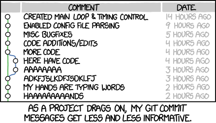

# Introduction to git

Welcome to this introduction to git! We'll have a look at some basic commands to get you covered.

## Get started

Create a directory, change into it and create an empty repository:

```
git init
```

Git will reply

```
Initialized empty Git repository in .git/
```

## Adding files to your git

The files you want git to track need to be added to the repository **explicitly**. Saving a file to the `git`-folder on your hard drive is **not enough**!

Create a file `tutorial.md` and add it to git:

```
git add tutorial.md
```

To add all files that exist in the working directory, you may use

```
git add .
```

## Taking snapshots

Everytime you want to take a snapshot of the current state of your working directory, you need to `commit` things to git:

```
git commit
```

This will prompt you for a commit message. Make sure to describe your commits in a meaningful way (relevant: https://xkcd.com/1296/ ).



## Making changes

Now, we do two things: we add a new file to the git, and we modify the content of an existing file. 

What needs to be done to add a new file to the git? Correct, we need to add it:

```
git add git_commit.png
```

And what happens to the changes made to `tutorial.md`? Let's check using `git status`:

```
On branch master
Changes to be committed:
  (use "git restore --staged <file>..." to unstage)
    new file:   git_commit.png

Changes not staged for commit:
  (use "git add <file>..." to update what will be committed)
  (use "git restore <file>..." to discard changes in working directory)
    modified:   tutorial.md
```

As you can see, git is about to include the new file and it noticed your changes to `tutorial.md`. **But**, these changes are not yet "added to commit"! So, if you do a `git commit` just now, only the new file is added! To also include the changes made to `tutorial.md` to the revision, you need to add the file again using `git add tutorial.md`. Alternatively, and maybe a little handier, you can use

```
git commit -a
```

This automatically adds all changes to the commit and then commits the revision all in one step. Be aware, though, that this doesn't add new files. New files have to be explicitly added as shown above.


## Branches in git

In a single git repository, you can have multiple branches. A branch is a parallel line of development for which you create a copy of the current state of the working directory. Use 

```
git branch braching
```
to create a branch called `branching`. If you now run

```
git branch
```
it says that your repository consists of two branches at this point:

```
  branching
* master
```

The `master` branch is the trunk of the repository. It is created automatically together with the empty repository. The asteriks marks the currently active branch. To switch to the `branching` branch, use

```
git switch branching
```

You can now make changes to your file `tutorial.md` and commit them using

```
git commit -a
```

When you switch back to the master branch (`git switch master`) you will notice that your changes are no longer visible.
